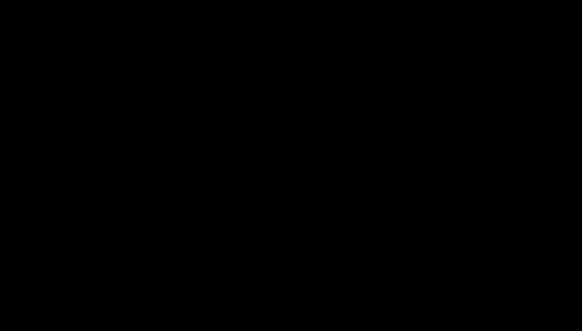

## Data preparation for Machine Learning: Future Selection, Future Engineering and Dimensionality Reduction
In this section we will be covering machine learning methods that are used to extract patterns from data, and sometimes predict future events
The data that goes into the algorithms are called features, and we can modify our set of features using feature engineering, feature selection and dimensionality reduction.
In this chapter, we'll cover the following topics:
Feature selection methods, including univariate statistical methods, such as correlation, mutual information score, chi-squared and other feature selection methods.
Feature engineering methods for categorical data, datetime data and outliers.
Using mathematical transforms for feature engineering
Dimensionality reduction using PCA

# Type of machine learning
Features can be used to extract patterns from the data with ML algorithms in a few ways:
Supervised learning(Classification, Regression)
Unsupervised learning
Reinforcement learning

# Feature selection
When we are using features to predict a target, some of the features will be more important than others.
With feature selection, we can screen our inputs for those that have the most promise
These features should have some relationship to the target variable so that we can predict the target with the features.

# The curse dimensionality
Feature selection is related to a concept called "the curse of dimensionality".
This idea is that as our number of dimensions(features) increases, a few things happen:
The volume of the sample space grows exponentially with increased dimensions.
We need exponentially more data to sufficiently cover the sample space as we increase our dimensions.
The distance to the center of the data (mean) increases and every point looks like an outlier.
Any arbitrary grouping of samples becomes linearly separable, also known as Cover's theorem. This leads to model overfitting because we fit to noise in the data instead of the underlying patterns.
The difference in relative distances between points approaches zero. For example, the distance from point A to B ends up being nearly the same as any other point to B.

# Overfitting and underfitting and the bias-variance trade-off
Overfitting happens when our model has too much complexity

# Methods of Feature Selection
There are several method of performing feature selection. Here are some common method.
Variance thresholding: Removing features with too little or too much variation.
Univariate statistical selection: Use statistical test between features and the targets to measure relationship strength
Sequential feature selection:
Forward selection: Start with one feature and add features one at a time. ML models are trained and evaluated to find the best features one at a time.
Backward selection: Start with all the features and subtract features one at a time: 
Recursive feature selection: Use an ML model with feature importance to remove unimportant features one at a time.
Built-in feature selection: Some models have built-in methods for feature selection, such as LASSO regularization  